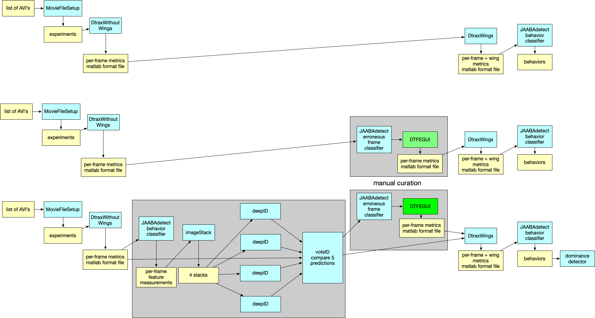

# Fly Social Pipeline



## Usage

You must have [Nextflow](https://www.nextflow.io) and [Singularity](https://sylabs.io) installed before running the pipeline.

### Local execution
```
./pipeline.nf --in /path/to/avis --config /path/to/config
```

### LSF execution on Janelia cluster
```
./pipeline.nf -profile lsf -with-tower 'http://nextflow.int.janelia.org/api' --in /path/to/avis --config /path/to/config
```
This also uses the internal Janelia instance of Nextflow Tower.

